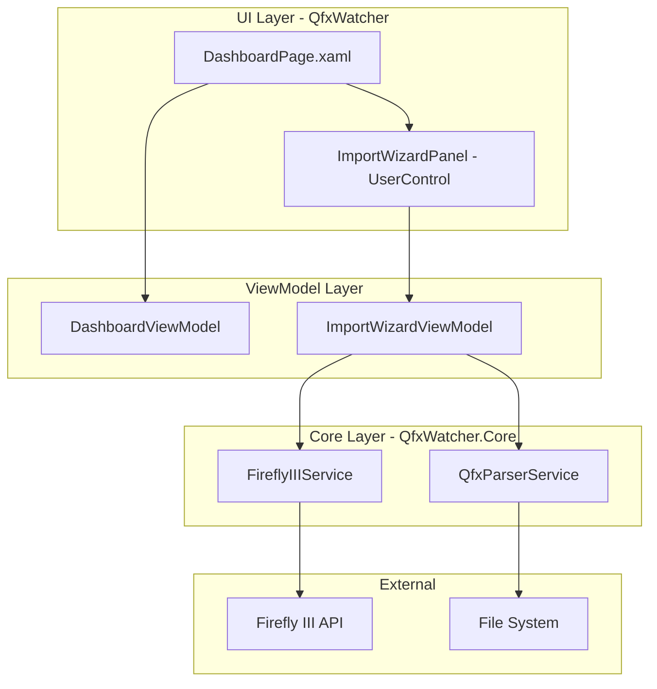
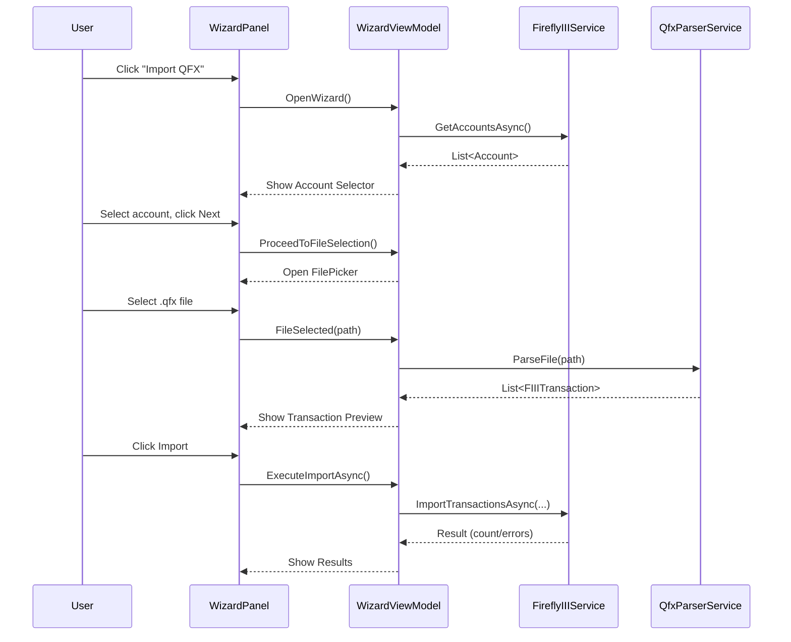

# Design Document: QFX Import Wizard

## Overview

The QFX Import Wizard adds a user-initiated, multi-step import flow to the Dashboard page of the QfxWatcher WinUI 3 application. Unlike the existing file-watcher-triggered `ContentDialog`, the wizard is an inline panel that guides the user through four sequential steps: account selection, file selection, transaction preview, and import execution.

The wizard reuses the existing `FireflyIIIService` and `QfxParserService` from `QfxWatcher.Core` and follows the project's established MVVM pattern using CommunityToolkit.Mvvm source generators.

### Key Design Decisions

1. **Inline panel vs. separate page** — The wizard renders inside the Dashboard page (as a collapsible/expandable panel) rather than navigating to a new page. This keeps the import log and status visible and avoids adding a new NavigationView item.
2. **ViewModel-driven state machine** — Wizard step transitions are managed by an `ImportWizardViewModel` that exposes the current step as an enum. The View uses a `ContentControl` with `DataTemplateSelector` (or visibility bindings) to swap step content.
3. **Reuse existing services** — `FireflyIIIService.GetAccountsAsync()` provides account data; `QfxParserService.ParseFile()` handles QFX parsing. No new service classes are needed.
4. **CancellationToken support** — Long-running operations (account fetch, import) accept a `CancellationToken` so the user can cancel mid-operation.

## Architecture



### Flow Sequence



## Components and Interfaces

### ImportWizardViewModel

The central ViewModel managing wizard state. Lives as a property on `DashboardViewModel` (or as a sibling registered in `App.xaml.cs`).

```csharp
public enum WizardStep
{
    Closed,
    AccountSelection,
    FileSelection,      // Transient — triggers FilePicker
    TransactionPreview,
    Importing,
    Results
}

public partial class ImportWizardViewModel : ObservableObject
{
    // Observable state
    [ObservableProperty] private WizardStep _currentStep = WizardStep.Closed;
    [ObservableProperty] private bool _isLoading;
    [ObservableProperty] private string _errorMessage = string.Empty;
    [ObservableProperty] private bool _canGoNext;
    [ObservableProperty] private bool _canGoBack;

    // Account selection
    public ObservableCollection<AccountRead> Accounts { get; }
    [ObservableProperty] private AccountRead? _selectedAccount;

    // File & transactions
    [ObservableProperty] private string _selectedFilePath = string.Empty;
    [ObservableProperty] private string _selectedFileName = string.Empty;
    public ObservableCollection<FIIITransaction> Transactions { get; }
    [ObservableProperty] private int _transactionCount;

    // Import progress
    [ObservableProperty] private int _importedCount;
    [ObservableProperty] private int _failedCount;
    [ObservableProperty] private int _totalCount;

    // Commands
    [RelayCommand] Task OpenWizardAsync();
    [RelayCommand] Task RetryLoadAccountsAsync();
    [RelayCommand] void SelectAccount(AccountRead account);
    [RelayCommand] void ProceedToFileSelection();
    [RelayCommand] Task ConfirmImportAsync();
    [RelayCommand] void GoBack();
    [RelayCommand] void Close();
    [RelayCommand] void ImportAnother();
}
```

### ImportWizardPanel (UserControl)

A XAML `UserControl` embedded in `DashboardPage.xaml`. Uses visibility bindings or a `ContentControl` to show the appropriate step UI based on `WizardStep`.

### DashboardPage Integration

The "Import QFX" button is added to the Status card. Its `IsEnabled` state is bound to `DashboardViewModel.IsConnected`. The wizard panel is placed below the status card and above the import log.

### Service Interface Changes

No new service interfaces are required. The existing `FireflyIIIService` already exposes:
- `GetAccountsAsync()` — returns asset accounts
- `ImportTransactionsAsync(accountId, transactions, errorIfDuplicateHash)` — imports transactions
- `TestConnectionAsync()` — validates connectivity

`QfxParserService.ParseFile(path)` is a static method that returns `IReadOnlyList<FIIITransaction>`.

## Data Models

### Existing Models (no changes)

| Model | Location | Purpose |
|-------|----------|---------|
| `FIIITransaction` | `QfxWatcher.Core/Models` | Parsed QFX transaction |
| `ImportLogEntry` | `QfxWatcher/Models` | Dashboard log row |
| `AppSettings` | `QfxWatcher/Models` | Persisted settings (includes `DefaultAccountId`) |

### New/Extended Models

#### `AccountRead` (from Firefly III generated client)

Already exists in the generated `QfxWatcher.FireflyIII` project. The `GetAccountsAsync()` method currently wraps results in `AccountSingle`; the wizard will use the `AccountRead` data objects directly for display (name, ID).

#### `WizardStep` enum

```csharp
namespace QfxWatcher.ViewModels;

public enum WizardStep
{
    Closed,              // Wizard not visible
    AccountSelection,    // Step 1: pick account
    FileSelection,       // Transient: native file picker open
    TransactionPreview,  // Step 2: review transactions
    Importing,           // Step 3: import in progress
    Results              // Step 4: success/failure summary
}
```

#### `ImportResult`

```csharp
namespace QfxWatcher.ViewModels;

public record ImportResult(
    int SuccessCount,
    int FailureCount,
    string? ErrorSummary);
```

## Correctness Properties

*A property is a characteristic or behavior that should hold true across all valid executions of a system — essentially, a formal statement about what the system should do. Properties serve as the bridge between human-readable specifications and machine-verifiable correctness guarantees.*

### Property 1: Wizard cannot open without a valid connection

*For any* application state where `IsConnected` is false (service unconfigured, authentication failed, or connection timed out), the wizard's `CanOpen` property SHALL be false, preventing the user from launching the import flow.

**Validates: Requirements 1.2**

### Property 2: Opening the wizard transitions to AccountSelection

*For any* valid pre-condition (wizard is Closed, service is connected), calling `OpenWizardAsync` SHALL transition `CurrentStep` to `WizardStep.AccountSelection`.

**Validates: Requirements 1.3**

### Property 3: All fetched accounts are exposed in the collection

*For any* non-empty list of active asset accounts returned by `FireflyIIIService.GetAccountsAsync()`, the `Accounts` observable collection SHALL contain every account from that list with no omissions or duplicates.

**Validates: Requirements 2.3**

### Property 4: DefaultAccountId pre-selects the matching account

*For any* list of accounts and any `DefaultAccountId` value from settings that matches an account ID in the list, `SelectedAccount` SHALL equal the account with that ID after the account list loads.

**Validates: Requirements 2.6**

### Property 5: CanGoNext requires exactly one selected account

*For any* wizard state where `CurrentStep` is `AccountSelection`, `CanGoNext` SHALL equal `(SelectedAccount != null)`.

**Validates: Requirements 2.7**

### Property 6: Backward navigation preserves the selected account

*For any* selected account, navigating backward (via cancel from FileSelection or GoBack from TransactionPreview) SHALL preserve `SelectedAccount` unchanged and return `CurrentStep` to `AccountSelection`.

**Validates: Requirements 3.3, 6.3**

### Property 7: TransactionCount equals the parsed collection size

*For any* list of transactions produced by the parser, `TransactionCount` SHALL equal `Transactions.Count`.

**Validates: Requirements 4.1**

### Property 8: Transactions are ordered by date descending

*For any* list of parsed transactions with two or more items, the `Transactions` collection SHALL be ordered such that for every adjacent pair (i, i+1), `Transactions[i].Date >= Transactions[i+1].Date`.

**Validates: Requirements 4.2**

### Property 9: Navigation controls reflect step constraints

*For any* wizard step:
- `CanGoBack` SHALL be true only when `CurrentStep` is `TransactionPreview`
- `CanGoBack` SHALL be false when `CurrentStep` is `Importing` or `Results`
- The confirm/import action SHALL be disabled when `CurrentStep` is `Importing`

**Validates: Requirements 5.2, 6.1, 6.2, 6.5**

### Property 10: Import accounting invariant

*For any* import execution over N transactions where some succeed and some fail, `ImportedCount + FailedCount` SHALL equal `TotalCount` (the original transaction count submitted for import).

**Validates: Requirements 5.5**

## Error Handling

| Scenario | Handling | User Experience |
|----------|----------|-----------------|
| Firefly III unreachable during account fetch | Catch `HttpRequestException` / `TaskCanceledException` (timeout) | Show error message in wizard panel with "Retry" button; remain on AccountSelection step |
| Account fetch returns 401/403 | Catch `ApiException` with status code | Show "Authentication failed — check your token in Settings" message |
| File picker cancelled | No exception; detect null/empty result | Return to AccountSelection with account preserved |
| File cannot be read (IOException) | Catch `IOException` | Show error message; allow user to pick a different file |
| QFX parse failure (malformed content) | Catch `Exception` from `QfxParserService.ParseFile` | Show "Could not parse file" error; return to file selection |
| Single transaction import fails (API error) | Catch per-transaction `ApiException`; increment `FailedCount` | Continue importing remaining transactions; show summary with both counts |
| All transactions fail | Same as above; `ImportedCount` will be 0 | Show failure summary; log entry records 0 successes and error message |
| Network loss mid-import | Catch `HttpRequestException` per transaction | Treat as individual failures; remaining transactions attempted |

### Error Recovery Strategy

- **Retry at step level**: Account fetch failures offer a retry button. File selection failures allow re-picking.
- **No rollback**: Transactions already imported to Firefly III are not rolled back on partial failure (Firefly III has no batch transaction API with atomicity).
- **Duplicate protection**: The `ErrorIfDuplicateHash` setting (from `AppSettings`) is passed through to prevent re-importing the same transactions if the user retries.

## Testing Strategy

### Unit Tests (Example-Based)

Unit tests cover specific scenarios and edge cases:

| Test | Validates |
|------|-----------|
| Button disabled when not connected | Req 1.2 |
| Loading indicator shown during fetch | Req 2.2 |
| Empty account list disables Next | Req 2.5 |
| File picker filter includes .qfx/.ofx | Req 3.2 |
| Successful parse advances to preview | Req 3.4 |
| Zero transactions disables import | Req 4.4 |
| Parse failure returns to file selection | Req 4.5 |
| Successful import adds log entry | Req 5.4 |
| Partial failure adds log entry with error | Req 5.6 |
| Results step shows Close and ImportAnother | Req 5.7 |
| Forward after back opens file picker | Req 6.4 |

### Property-Based Tests

Property-based tests verify universal properties across generated inputs. The project will use **FsCheck** (via `FsCheck.Xunit`) as the PBT library for .NET.

**Configuration:**
- Minimum 100 iterations per property test
- Each test tagged with: `Feature: qfx-import-wizard, Property {N}: {description}`

| Property Test | Validates |
|---------------|-----------|
| Wizard CanOpen reflects connection state | Property 1 |
| OpenWizard always transitions to AccountSelection | Property 2 |
| All fetched accounts appear in collection | Property 3 |
| DefaultAccountId pre-selects correctly | Property 4 |
| CanGoNext iff account selected | Property 5 |
| Backward navigation preserves account | Property 6 |
| TransactionCount equals collection size | Property 7 |
| Transactions sorted by date descending | Property 8 |
| Navigation controls match step constraints | Property 9 |
| ImportedCount + FailedCount = TotalCount | Property 10 |

### Integration Tests

Integration tests verify end-to-end behavior with the Firefly III API:

- Account fetch returns real data from a test Firefly III instance
- Import creates transactions visible in Firefly III
- Duplicate hash detection prevents re-import

### Test Project Structure

```
QfxWatcher.Tests/
├── ViewModels/
│   ├── ImportWizardViewModelTests.cs          (unit tests)
│   └── ImportWizardViewModelPropertyTests.cs  (property-based tests)
└── QfxWatcher.Tests.csproj
```

